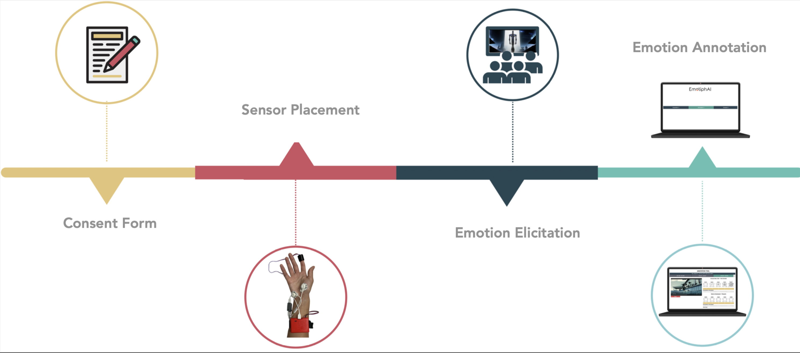
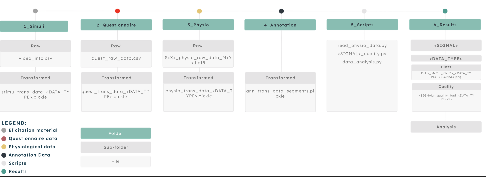

# g-rex_public
**A Real-World Annotated Physiological Dataset of Group Experiences**

## Motivation
Emotion recognition using physiological data has demonstrated promising results in controlled experiments. However, these findings often struggle to generalize to real-world environments. Furthermore, most existing datasets focus on individual data collections, which limits their applicability to group dynamics and shared experiences.

## Methods
Physiological data, including photoplethysmography (PPG) and electrodermal activity (EDA), was collected using a wrist-worn device during extended movie sessions. Data collection was facilitated by the EmotiphAI system, which can be accessed [here](https://github.com/PatriciaBota/EmotiphAI_public). Emotion annotations were retrospectively applied to segments with elevated physiological responses using the EmotiphAI [Annotator](https://ieeexplore.ieee.org/document/10416364). The design of this setup ensures it is easily replicable in real-life scenarios, enabling the collection of large-scale datasets to advance novel affective computing systems.

  
  

## Results
The dataset comprises over 31 movie sessions, resulting in more than 380 hours of data from over 190 participants. Data quality was assessed using state-of-the-art metrics, and the dataset was divided into high and lower quality subsets. The full dataset is publicly available on [Zenodo](https://zenodo.org/records/8136135).

For detailed methodology and technical specifications, refer to the scientific paper available [here](https://www.nature.com/articles/s41597-023-02905-6).

## Acknowledge
This work was partially funded by FCT - Fundação para a Ciência e a Tecnologia under grant 2020.06675.BD, by the FCT/MCTES through national funds and when applicable co-funded EU funds under the projects UIDB/50008/2020 and PCIF/SSO/0163/2019 (SafeFire), and by IT - Instituto de Telecomunicações. The authors would like to thank Diferencial for allowing us to collect data during the cinema sessions, namely Patrícia Marques and João Mendes. As well as my colleagues at IST, Sofia Monteiro, Ana Sofia Carmo, Rui Maciel and Rafael Silva for their help in assisting during the data collection sessions. And lastly, Mariana Abreu and Vicente Garção from IST for helping name the dataset.
